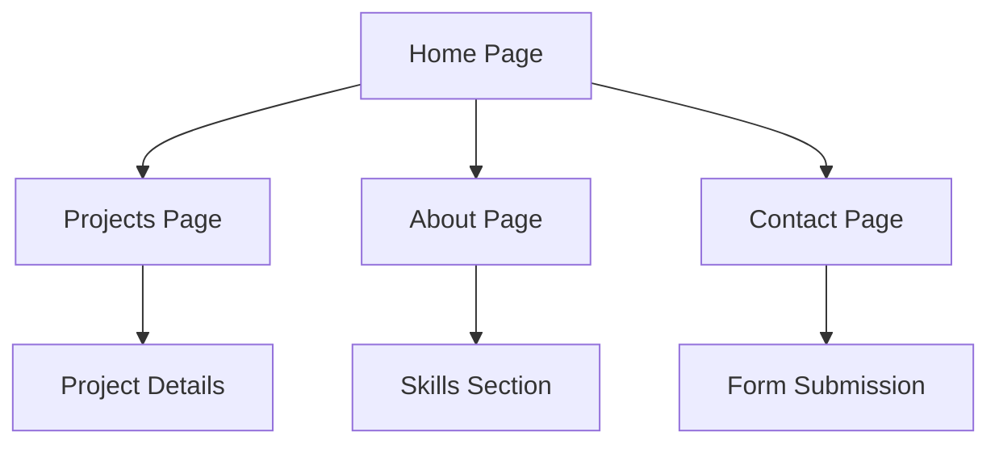

## 1. Product Overview
A personal portfolio website showcasing professional work and skills with a light, playful design inspired by DevFest Jakarta's visual aesthetic. The website features high contrast elements, rounded pill components, and decorative geometric elements on a dotted grid background.

Target audience includes potential clients, employers, and collaborators seeking to evaluate the portfolio owner's professional capabilities and creative approach.

## 2. Core Features

### 2.2 Feature Module
The portfolio website consists of the following main pages:
1. **Home page**: hero section with introduction, navigation header, call-to-action buttons, and decorative elements.
2. **Projects page**: project showcase with filtering capabilities and detailed project views.
3. **About page**: personal introduction, skills display, and professional background.
4. **Contact page**: contact form and social media links.

### 2.3 Page Details
| Page Name | Module Name | Feature description |
|-----------|-------------|---------------------|
| Home page | Header Navigation | Display logo, navigation menu (Details, Speaker, Topics, Venue, FAQ), and "Secure your seat" CTA button with rounded pill styling. |
| Home page | Hero Section | Show headline "Connect, Learn, and Grow", date pill "November 30, 2025", venue pill with location, descriptive text, and two action buttons. |
| Home page | Decorative Elements | Pink circular dots, yellow geometric burst shape, dotted gray grid background for visual enhancement. |
| Projects page | Project Grid | Display projects in a responsive grid layout with project cards showing title, description, and preview images. |
| Projects page | Project Filter | Provide category filtering options to sort projects by type or technology stack. |
| Projects page | Project Details | Show expanded project information including full description, technologies used, and live demo links. |
| About page | Personal Introduction | Present professional background, expertise areas, and career highlights in engaging format. |
| About page | Skills Display | Showcase technical and soft skills with visual indicators or progress bars. |
| Contact page | Contact Form | Include form fields for name, email, subject, and message with form validation. |
| Contact page | Social Links | Display social media and professional platform links with icon representations. |

## 3. Core Process
User navigates through the portfolio starting from the Home page with its eye-catching hero section. Users can explore projects through filtering and detailed views, learn about the portfolio owner through the About page, and initiate contact via the Contact page. The design emphasizes visual appeal with decorative elements while maintaining professional functionality.

## 4. User Interface Design

### 4.1 Design Style
- **Primary Colors**: oklch(71.8% .202 349.761) - vibrant pink/coral, oklch(70.7% .165 254.624) - blue
- **Secondary Colors**: oklch(54.6% .245 262.881) - deep blue, oklch(85.2% .199 91.936) - yellow, oklch(27.4% .006 286.033) - dark gray, oklch(90.5% .093 164.15) - mint green, oklch(90.1% .058 230.902) - light blue
- **Button Style**: Rounded pill shapes with gradient/solid fills and subtle shadows
- **Font**: Plus Jakarta Sans with varied weights (regular, medium, semibold, bold)
- **Layout**: Card-based design with generous spacing and high contrast
- **Decorative Elements**: Pink circular dots, yellow geometric bursts, dotted grid background

### 4.2 Page Design Overview
| Page Name | Module Name | UI Elements |
|-----------|-------------|-------------|
| Home page | Header | Light background with black text, rounded pill CTA button with blue gradient, playful logo placement |
| Home page | Hero | Large bold headline in black, colored pills for date/venue info, descriptive paragraph, two contrasting action buttons |
| Projects page | Project Grid | Clean card layout with project previews, hover effects, consistent spacing |
| About page | Skills | Visual skill indicators, professional headshot placement, timeline or experience display |
| Contact page | Form | Rounded input fields, prominent submit button, social media icon grid |

### 4.3 Responsiveness
Desktop-first design approach with mobile-responsive layouts. Touch interaction optimization for mobile devices with appropriately sized tap targets and swipe-friendly navigation.