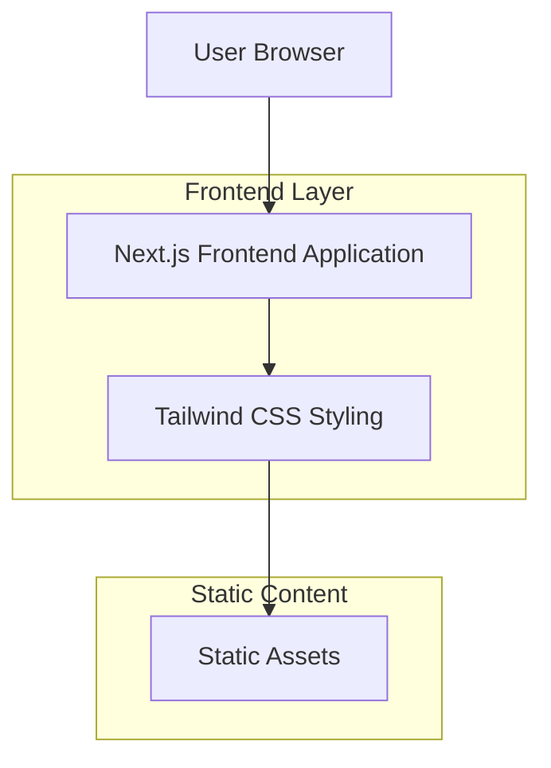

## 1. Architecture design



## 2. Technology Description
- **Frontend**: Next.js@14 + React@18 + TypeScript
- **Styling**: Tailwind CSS@3 with custom OKLCH color configuration
- **Font**: Plus Jakarta Sans via Google Fonts or next/font
- **Initialization Tool**: create-next-app
- **Backend**: None (static site generation)

## 3. Route definitions
| Route | Purpose |
|-------|---------|
| / | Home page with hero section and navigation |
| /projects | Projects showcase with filtering capabilities |
| /about | Personal introduction and skills display |
| /contact | Contact form and social media links |

## 4. Component Architecture
### 4.1 Core Components
- **Header**: Navigation menu with logo and CTA button
- **Hero**: Headline, descriptive text, info pills, action buttons
- **ProjectCard**: Individual project display with hover effects
- **ProjectFilter**: Category-based filtering interface
- **SkillsDisplay**: Visual skill representation
- **ContactForm**: Form with validation and submission handling
- **DecorativeElements**: Pink dots, yellow bursts, dotted grid

### 4.2 Styling Configuration
```javascript
// tailwind.config.js
module.exports = {
  theme: {
    extend: {
      colors: {
        'primary-pink': 'oklch(71.8% .202 349.761)',
        'primary-blue': 'oklch(70.7% .165 254.624)',
        'secondary-blue': 'oklch(54.6% .245 262.881)',
        'accent-yellow': 'oklch(85.2% .199 91.936)',
        'text-dark': 'oklch(27.4% .006 286.033)',
        'mint-green': 'oklch(90.5% .093 164.15)',
        'light-blue': 'oklch(90.1% .058 230.902)',
      },
      fontFamily: {
        'jakarta': ['Plus Jakarta Sans', 'sans-serif'],
      },
      borderRadius: {
        'pill': '9999px',
      },
    },
  },
}
```

## 5. Performance Optimization
- **Static Generation**: Pre-render pages at build time for optimal performance
- **Image Optimization**: Use Next.js Image component for automatic optimization
- **Font Loading**: Implement font-display: swap for better perceived performance
- **CSS Optimization**: Purge unused styles with Tailwind CSS
- **Bundle Splitting**: Automatic code splitting for optimal loading

## 6. Development Workflow
1. Initialize project with create-next-app
2. Configure Tailwind CSS with custom OKLCH colors
3. Set up Plus Jakarta Sans font
4. Create reusable component library
5. Implement responsive design patterns
6. Add decorative elements and animations
7. Optimize for production build